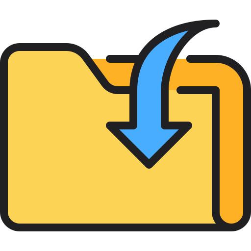

    

     
    
    

­

#

ExtSorter es una aplicación de escritorio desarrollada con Qt que permite organizar ficheros de forma sencilla a partir de sus extensiones.

El programa clasifica automáticamente los ficheros en categorías, como imágenes, audio, vídeo, documentos... y mueve todos los ficheros a una carpeta concreta según esta categoria. Tras organizar, el programa ofrece al usuario opciones para manipular estas carpetas de manera segura.

## Índice de contenidos
- [Showcase](#showcase)
- [Requisitos e Instalación](#requisitos-e-instalación)
- [Cómo usar](#cómo-usar)
	- [Opciones](#opciones)
	- [Ver extensiones y categorías](#ver-extensiones-y-categorías)
	- [Añadir/Eliminar nuevas categorías y extensiones](#añadireliminar-nuevas-categorías-y-extensiones)
- [Próximas características](#próximas-características)
- [Créditos](#créditos)

## Showcase

## Requisitos e Instalación
Actualmente el programa **solo es compatible con Windows**.

Puedes instalar la última versión del programa [aquí](insertar enlace a la release). El programa es un simple ejecutable, así que no necesitas instalar nada extra.

Si decides ejecutar el programa desde el código fuente, necesitarás tener instalado:
- Qt 6
- Qt Creator

Para ejecutarlo, simplemente abre el proyecto con Qt Creator y ejecútalo.

## Cómo usar
ExtSorter está pensado para usarse en **carpetas desordenadas** con una gran cantidad de ficheros (como _podrían_ ser el Escritorio o Descargas). La interfaz de ExtSorter hace que el programa sea muy intuitivo de usar, por lo que probablemente no necesites ver este apartado.

Para empezar a usar ExtSorter, se selecciona una carpeta con el botón o desde la barra del menú con ``Archivo -> Abrir``.

    

<i><b>Pantalla principal</b></i>
 

Una vez seleccionada la carpeta, se pulsa el botón Comenzar. ExtSorter creará una carpeta dentro de la carpeta seleccionada, llamada ``ExtSorter``, donde se guardarán las carpetas con los ficheros ordenados.

Hay ocasiones en las que el programa puede no continuar:
- La carpeta está vacía o no tiene ficheros (solo carpetas).
- El usuario no tiene permisos para leer/escribir la carpeta seleccionada.

>_Notas importantes_
>- El programa no toma en cuenta todas las extensiones de ficheros existentes, por lo que los ficheros cuya extensión no esté contemplada por el programa serán movidos a una carpeta llamada `Otros`.
>
>- Las carpetas llenas son ignoradas. Las carpetas vacías pueden eliminarse si se marca su opción (ver [_Opciones_](#opciones)).

Una vez se termina, saltará un mensaje avisando de que el proceso finalizó. Cerrar el cuadro hará que el programa pase a la ventana de manipulación de las carpetas (ventana final).

    

<i><b>Pantalla final</b></i>
 

En esta ventana se puede decidir qué hacer con las carpetas que ha creado el programa; simplemente marca las casillas con las carpetas a manipular y selecciona la acción:
- ``Comprimir``: comprime las carpetas seleccionadas en un fichero `.zip`. El fichero se crea en la carpeta ``ExtSorter``.
- ``Eliminar``: elimina las carpetas seleccionadas.
- ``Mover``: mueve las carpetas seleccionadas a otra carpeta, seleccionada por el usuario.

Cuando el número de ficheros dentro de las carpetas seleccionadas es muy grande (>= 100) las acciones ``Eliminar`` y ``Mover`` solicitarán una confirmación.

Dentro de esta ventana, también puedes:
- Abrir la carpeta ``ExtSorter`` (botón ``Abrir carpeta``).
- Salir del programa (botón ``Terminar``)
- Volver a la ventana principal (botón ``Volver``).

### Opciones
Antes de comenzar el programa, puedes seleccionar tres opciones en la ventana principal:
- ``Borrar carpetas vacías``: si se marca, el programa eliminará todas las carpetas vacías que encuentre en la carpeta seleccionada.

- ``Borrar accesos directos``: si se marca, el programa eliminará todos los accesos directos que encuentre en la carpeta seleccionada.

- ``Excluir Otros``: si se marca, el programa ignorará los ficheros cuya extensión no esté contemplada por el programa, en lugar de crear una carpeta para ellos.

### Ver extensiones y categorías
Para ver las categorías y extensiones del programa, ve a la barra del menú y dale a ``Ver -> Categorías y extensiones``. Se abrirá una ventana con una tabla con todas las categorías y extensiones.

    

<i><b>Pantalla ver categorías y extensiones</b></i>
 

El programa cuenta por defecto con 7 categorías y 77 extensiones. En la siguiente tabla se muestran las categorías y extensiones predeterminadas del programa.

| Categoría   | Extensiones |
|-------------|-------------|
| **Audio**      | aac, ac3, aiff, aif, flac, m4a, mp3, ogg, pca, w64, wav, wma |
| **Código**     | asm, c, cc, cpp, cs, go, h, hpp, java, lua, pl, py, rb, rs, swift, ts |
| **Comprimido** | 7z, bz2, gz, rar, tar, zip |
| **Documento**  | accdb, doc, docm, docx, mpp, odg, odp, ods, odt, pdf, ppt, pptx, xls, xlsm, xlsx |
| **Ejecutable** | bat, cmd, exe, msi |
| **Imagen**     | bmp, dib, gif, jfif, jpeg, jpg, pbm, pgm, png, pnm, ppm, qtif, svg, tiff, webp |
| **Proyecto**   | ai, aep, aup3, kra, prproj, psd, veg, xcf |
| **Texto**      | csv, log, md, txt |
| **Video**      | avi, flv, m4v, mkv, mov, mp4, mpg, mxf, webm, wmv |

### Añadir/Eliminar nuevas categorías y extensiones
El programa permite personalizar por completo las categorías y las extensiones que se manejan. Puedes crear nuevas categorías aparte de las que vienen por defecto o eliminarlas y crear tus propias categorías con las extensiones que quieras.

- Para **crear** una nueva categoría, haz click en ``Archivo -> Añadir Categorías``. Se abrirá una ventana en la que podrás elegir el nombre y las extensiones para la nueva categoría.

    

<i><b>Pantalla añadir categorías</b></i>
 

- Para **eliminar** una categoría, haz click en ``Archivo -> Eliminar Categorías``. Se abrirá una ventana en la que podrás seleccionar la categoría a eliminar o, si se prefiere, eliminarlas todas.

    

<i><b>Pantalla eliminar categorías</b></i>
 

- Para **añadir nuevas extensiones** a una categoría, haz click en ``Archivo -> Añadir Extensiones``. Se abrirá una ventana en la que podrás seleccionar una de las categorías creadas para añadir nuevas extensiones.

    

<i><b>Pantalla añadir extensiones</b></i>
 

- Para **restablecer** las categorías y extensiones a las predeterminadas, puede usarse el botón ``Restablecer`` dentro de las ventanas de ``Añadir Extensiones`` y ``Añadir Categorías``, o directamente desde ``Ver -> Restablecer extensiones``.

## Próximas características
- [ ] Detección y tratamiento de ficheros duplicados.
- [ ] Compresión de ficheros con quazip.

## Créditos
Los iconos usados en el programa no son míos, fueron creados por otros autores y descargados desde [Flaticon](https://www.flaticon.com). En la siguiente tabla se acreditan a los creadores de cada icono.

| Autor | Iconos |
|-------|--------|
| [Kerismaker](https://www.flaticon.com/authors/kerismaker) * |  |
| [Freepik](https://www.flaticon.com/authors/freepik) |      |
| [kmg design](https://www.flaticon.com/authors/kmg-design) |   |
| [Anggara](https://www.flaticon.com/authors/anggara) |   |
| [iconixar](https://www.flaticon.com/authors/iconixar) ** |  |
| [Laisa Islam Ani](https://www.flaticon.es/autores/laisa-islam-ani) |  |

---

\* El icono original fue ligeramente modificado, añadiendo un trazo negro alrededor y dentro del mismo.\
\*\* El icono original fue ligeramente modificado, cambiando el color del fichero de blanco a azul.  
